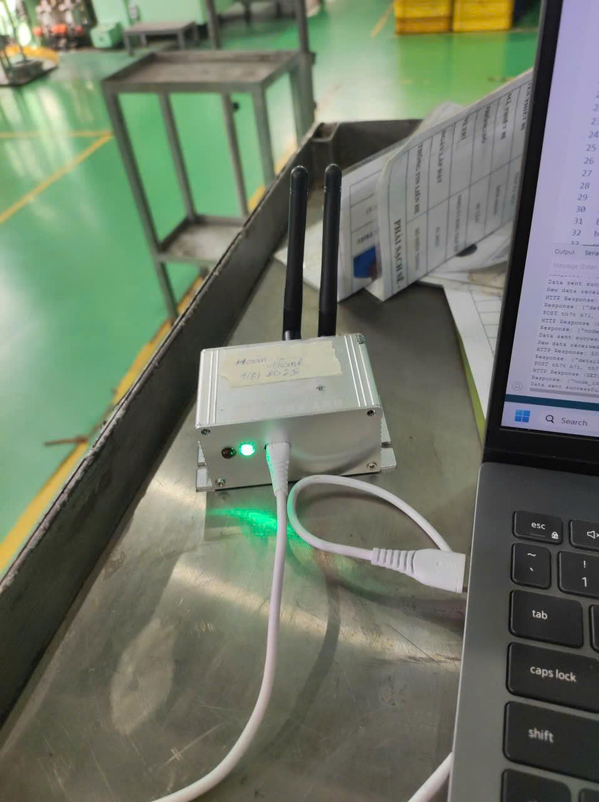

# IoT Gateway with Zigbee & WiFi (ESP32)

## 📌 Description
This project implements an IoT gateway on **ESP32** that bridges **Zigbee data** to a cloud API over **WiFi**.  
It integrates **UART communication**, **HTTP POST**, and an **OLED display** for live status monitoring.  
The gateway ensures reliable data transfer with LED indicators and supports multiple device IDs.

## ⚙️ Features
- Collects data from Zigbee nodes via UART.
- Sends data packets to a REST API server using HTTP POST/GET.
- OLED screen displays **WiFi status, data status, and LED state**.
- Auto reconnect for WiFi and OLED (hot-swap supported).
- Timeout mechanism → switch to RED LED if no Zigbee signal is detected.
- Supports multiple device serial numbers (`123, 124, 125`).

## 🛠️ Hardware Requirements
- **ESP32 module**  
- **Zigbee module (UART interface)**  
- **OLED display (I2C, 0x3C address)**  
- **Power supply (USB 5V)**  
- **LED indicators (Green & Red)**

## 🖥️ Software
- **Programming language**: C++ (Arduino framework)  
- **Libraries used**:  
  - `WiFi.h`  
  - `HTTPClient.h`  
  - `Wire.h` (I2C for OLED)  
  - `HardwareSerial.h`

## 🔑 Key Functions
- `initOLED()` → initialize OLED.  
- `readUARTData()` → parse Zigbee data from UART.  
- `sendHTTPPost()` → send collected data to API server.  
- `updateOLEDStatus()` → update real-time display.  
- **Timeout handler** → switch LED to RED if no Zigbee data in 10s.
## 📡 API Endpoint
http://116.118.44.82:8007/status

Data format (example):

Data format (example):
SN123UA220IA05.0PA120UB221IB05.1PB122UC219IC05.2E04567P8

## ✅ Results & Evaluation
- Successfully tested with **multiple Zigbee devices**.  
- Real-time WiFi/OLED updates confirmed.  
- Reliable data posting to server.  

## 🚀 Future Work
- Add **MQTT support** for more scalable IoT integration.  
- Enclosure optimization and power efficiency improvement.  

---
🔧 Developed as part of **Embedded Systems IoT Application Project** (2025).

## 📡 API Endpoint
